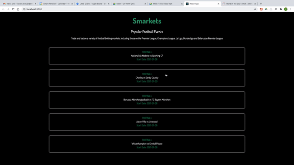

# Project Image


# Project Notes
- This project was created using create-react-app
- Unit testing has been added for components
- Animation was added using animate.css
- In production I would have added the api details in a ```.env.production``` file


## Available Scripts

In the project directory, you can run:

### `yarn start`

Runs the app in the development mode.\
Open [http://localhost:3000](http://localhost:3000) to view it in the browser.

The page will reload if you make edits.\
You will also see any lint errors in the console.

### `yarn test`

Launches the test runner in the interactive watch mode.\
See the section about [running tests](https://facebook.github.io/create-react-app/docs/running-tests) for more information.
